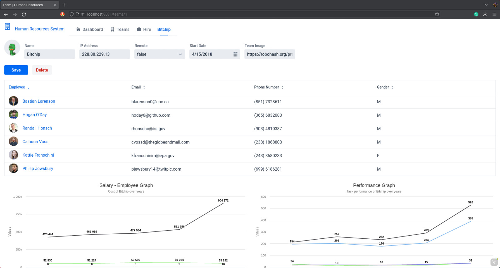

<p align="center">
  <a href="https://github.com/umutsevdi/hr-management">
  <h3 align="center">HR Management, Analytics and Salary Determination System</h3>
  </a>

<p align="center">  
 Analysis of Working Data and Salary Determination System
  <br/>
    <i>Developed by <a href="https://github.com/umutsevdi"> Umut Sevdi</a>,
    <a href="https://github.com/emrearslanoglu">Emre Arslanoglu</a></i>
<p align="center"><a href="doc/rapor.pdf"><strong>Explore the docs »
</strong></a></p>

<details open="open">
  <summary>Table of Contents</summary>
  <ol>
    <li><a href="#project_definition">Project Definition</a></li>
    <li><a href="#system_architecture">System Architecture</a></li>
    <li><a href="#hardware">Hardware Requirements</a></li>
    <li><a href="#installation">Installation</a></li>
    <li><a href="LICENSE">License</a></li>
    <li><a href="#contact">Contact</a></li>
  </ol>
</details>

<p align="center"></p>

<p id="project_definition">

## 1. Project Definition

We developed this project for large companies with a large number of employees
to be able to perform deep analyses on the status of their employees, to examine
their performances on a team or individual basis, and to determine the salaries
of employees who will be subject to salary adjustments when hiring new employees
or at the end of the year in a fair manner and to maintain the internal order of
the company.

The information of the employees uploaded to the system can be examined in detailed
analyses and tables. The salary policy will be determined by Data Mining on the
information of the existing employees. Rather than being determined by examining
which employee qualities are more valuable and which qualities are more useful,
it will be carried out with the valuable data kept by human resources previously
obtained. It provides a complete service for the management of projects in
which employees are involved. In our project, the training set that will determine
the salary is divided into working hours, the number of sprints participated in,
pending sprint task assignments, all tasks completed so far, delayed tasks, and
tasks that cannot be completed. In addition to these, team average score and title
are used. Individual and team statistical analyses from the past to the present based
on performance and salary have been prepared.

<p align="center"></p>

<p id="system_architecture">

## 2. System Architecture

Our program consists of two different parts. User interface is written in Java using
[Spring Boot](https://spring.io/projects/spring-boot) and [Vaadin](vaadin.com/).
The Project is built using Maven.

We used [Postgresql](https://www.postgresql.org/) as database.

Data mining section is written in Python using [scikitlearn](https://scikit-learn.org/stable/index.html).
Data used to train the model in the project:

- Working hours
- Number of sprints participated in
- Pending sprint tasks
- Delayed tasks
- Uncompleted tasks
- Team average score and title

<p align="center"></p>

<p align="center"></p>

<p id="installation">

### 3. Installation

Requires at least `Java 8` and `Python 3`.

1. Clone the repo

```sh
   git clone https://github.com/umutsevdi/hr-management.git
```

2. Run the maven script in the directory that contains `pom.xml` to download
   Java dependencies.

```sh
    mvn clean install
```

3. Download the dependencies for Python.

- numpy
- pandas
- scikit-learn

4. Run the docker-compose.yaml.

```sh
    cd webapp/
    docker-compose up
```

5. Run the SQL scripts in the webapp/hr-management/sql to generate data.

6. Compile and run the Java program.

## 5. License

Distributed under the MIT License. See `LICENSE` for more information.

<p id="contact">

## 6. Contact

You can contact any developer of this project for any suggestion or information.

Project: [umutsevdi/hr-management](https://github.com/umutsevdi/hr-management)

<i>Developed by <a href="https://github.com/umutsevdi"> Umut Sevdi</a>,
<a href="https://github.com/emrearslanoglu">Emre Arslanoglu</a></i>
